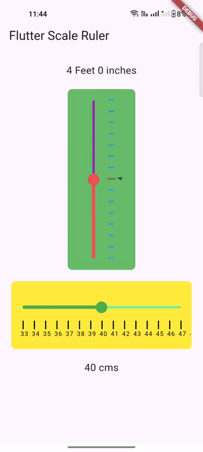

# flutter_scale_ruler

A simple scale ruler for adding length in feet and inches and cms.
## Screenshots

 

## Usage

[Example](https://github.com/boffincoders/flutter_scale_ruler/blob/master/example/example.dart)

To use this package :

- add the dependency to your [pubspec.yaml](https://github.com/boffincoders/flutter_scale_ruler/blob/master/pubspec.yaml) file.

 ```yaml
 dependencies:
    flutter:
      sdk: flutter
    flutter_scale_ruler:
```
    
### How to use

```dart
import 'package:flutter/material.dart';
import 'package:flutter_scale_ruler/flutter_scale_ruler.dart';

void main() {
  runApp(MyApp());
}

class MyApp extends StatelessWidget {
  @override
  Widget build(BuildContext context) {
    return MaterialApp(
      title: 'Flutter Scale Ruler',
      theme: ThemeData(
        primarySwatch: Colors.blue,
      ),
      home: MyHomePage(title: 'Flutter Scale Ruler'),
    );
  }
}

class MyHomePage extends StatefulWidget {
  MyHomePage({Key? key, required this.title}) : super(key: key);

  final String title;

  @override
  _MyHomePageState createState() => _MyHomePageState();
}

class _MyHomePageState extends State<MyHomePage> {
  ScaleValue? _scaleValue;
  ScaleValue? _scaleValueCms;

  @override
  Widget build(BuildContext context) {
    return Scaffold(
      appBar: AppBar(
        title: Text(widget.title),
      ),
      body: Padding(
        padding: const EdgeInsets.all(20.0),
        child: Column(
          crossAxisAlignment: CrossAxisAlignment.center,
          mainAxisAlignment: MainAxisAlignment.center,
          children: [
            Text(
              "${_scaleValue?.feet ?? "0"} Feet ${_scaleValue?.inch ?? "0"} inches",
              style: TextStyle(fontSize: 18.0),
            ),
            SizedBox(
              height: 20.0,
            ),
            ScaleRuler(
              maxValue: 8,
              minValue: 2,
              onChanged: (ScaleValue? scaleValue) {
                setState(() {
                  _scaleValue = scaleValue;
                });
                print("${scaleValue?.feet} Feet ${scaleValue?.inch} inches");
              },
            ),
            SizedBox(
              height: 20.0,
            ),
            ScaleRuler(
              maxValue: 20,
              minValue: 0,
              isCMS: true,
              backgroundColor: Colors.yellow[500],
              sliderActiveColor: Colors.green[500],
              sliderInactiveColor: Colors.greenAccent,
              onChanged: (ScaleValue? scaleValue) {
                setState(() {
                  _scaleValueCms = scaleValue;
                });
                print("${scaleValue?.cms} cms");
              },
            ),
            SizedBox(
              height: 20.0,
            ),
            Text(
              "${_scaleValueCms?.cms ?? "0"} cms",
              style: TextStyle(fontSize: 18.0),
            ),
          ],
        ),
      ),
    );
  }
}
```
    


